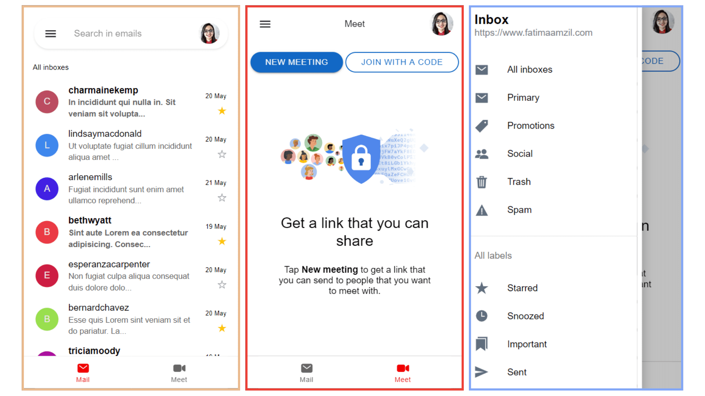

# Gmail Clone (Mobile version) with Ionic and Angular

# Mini Gmail Clone Mobile App
App designed for mobile version, you can open the app on the browser in mobile mode.
## The app looks like (give it a ⭐ if you like it)

## Demo

## Gmail clone with basic functionnalities
- [x] (Menu)
- [x] (Tabs: emails and meet)
- [x] (Fetching emails)
- [x] (Fetching emails per category: primary, promotions, social)
- [x] (Email details)
- [ ] (Much more can be implemented, feel free to contribute ^^)

## Requirements
- NodeJS

## Run the app
- `npm install`
- `ionic serve`

## Run unit tests
- `npm test`

## Build the app
- `ionic build --prod`
- `ionic capacitor add [options]` Add capacitor to install platform packages and add android, ios, ...Etc.
- `ionic capacitor build [options]`: android/ios

## Development server

The app is designed for mobiles, make sure you open the app on the browser with the mobile mode activated.
- Run `ionic serve` for a dev server. 
- Navigate to `http://localhost:8100/`. 
The application will automatically reload if you change any of the source files.
